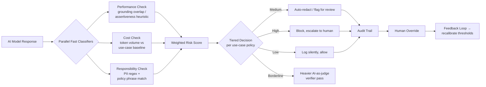

# ControlPlane.ai
**Finding it first — not finding out.**

A real-time risk-checking layer that sits on top of any AI deployment and evaluates every response across three dimensions — **Performance** (is it grounded / confidently wrong?), **Cost** (is it burning compute or rework?), and **Responsibility** (is it biased, unsafe, or leaking data?) — before it reaches a user or downstream system.

This repository contains a working prototype of the core detection-and-decision mechanism, submitted for Round 2 of the Accenture Innovation Challenge 2026.

---

## Live demo

Open `index.html` in any browser — no install, no API key, no backend required. Everything runs client-side so it's safe to demo offline.

1. **Run a live check** — paste an AI response (and optionally a source document) and watch the three detectors score it in real time.
2. **Run the batch demo** — replays 18 simulated interactions across all three use cases (customer chatbot, internal copilot, regulated decision-support), including PII leaks, hallucinated claims, cost outliers, borderline/ambiguous cases, and one bias case, to show system behavior at scale.
3. **Check the confidence indicator** — every check reports a confidence percentage alongside its risk score, separate from the risk level itself. Confidence drops when there's no source to verify against, when the score sits right on a decision-tier boundary, or when the three detectors disagree sharply with each other.
4. **Adjust the governance sliders** — change the medium/high risk thresholds per use case live and watch the same detection scores produce different tiered actions.
5. **Override a decision** — every row in the audit trail can be overridden with a reason, simulating the human-in-the-loop feedback signal a production system would use to recalibrate.

## Why this design

The brief's real-world complexities directly shaped the architecture:

| Complexity from the brief | How the prototype addresses it |
|---|---|
| Different use cases have different risk/latency budgets | Each use case has its own detection weights and thresholds (`USE_CASES` config) — a customer chatbot weighs Responsibility highest, a regulated decision-support tool weighs Performance highest with stricter thresholds |
| Bias / hallucination / privacy risks overlap | The Responsibility and Performance scores are computed independently but combined into one weighted overall score, rather than forcing a single category label |
| No reliable real-time ground truth | The grounding checker degrades gracefully: with a source doc it scores lexical overlap; without one, it falls back to a claim-assertiveness heuristic (flags absolute/unhedged language) and says so explicitly in its output |
| Communicating uncertainty, not just a score | Every check reports a confidence percentage alongside its risk tier — separate from the risk level itself. Confidence drops when there's no source to verify against, when the score sits right on a decision-tier boundary, or when the three detectors disagree sharply |
| Over-flagging vs under-flagging tradeoff | The "Alert-Fatigue Tradeoff Simulator" sweeps the flagging threshold across the batch results and plots false positives against false negatives, making the tuning tradeoff visible and explicit rather than solving it away |
| Enterprises consume models via API, not owning them | All checks work purely on the *input/output text*, never on model internals — this is designed to sit outside the model as middleware |
| Regulatory / policy differences by geography and use case | The threshold sliders are a stand-in for a configurable policy layer — same detectors, different governance per deployment |
| Feedback loops | The audit trail's override mechanism logs every human correction, which in production would feed back into recalibrating detection thresholds |

## Architecture



In production, "Parallel Fast Classifiers" would be actual lightweight models/embeddings running asynchronously (adding milliseconds, not seconds), with the heavier verifier LLM-as-judge pass reserved only for scores that land in the borderline band — exactly as scoped in the concept deck. The prototype simulates this same shape deterministically so the mechanism is inspectable and reproducible without needing live model calls or API keys.

## What's simulated vs. what would change in production

Being transparent about scope, since this is a proof-of-concept on illustrative data, not a production system:

- **Grounding check**: prototype uses lexical word-overlap; production would use embedding similarity + retrieval verification against a real knowledge base, plus an actual LLM-as-judge pass for borderline cases.
- **PII / policy detection**: prototype uses regex + a small keyword list; production would use dedicated PII/entity-detection models and a maintained, regularly-updated policy ruleset per jurisdiction.
- **Cost anomaly detection**: prototype compares against a fixed baseline; production would track a rolling statistical baseline per use case and flag genuine anomalies (z-score / EWMA), including retries and rework, not just single-response length.
- **Scale**: prototype demonstrates the mechanism on 12 representative interactions; the reference parameters assume tens of thousands of weekly interactions, which the architecture is designed to support since each check is a lightweight, parallelizable, stateless function.

## Assumptions

- Enterprise runs 3 concurrent AI use cases (customer-facing, internal, regulated decision-support), each with distinct latency/risk tolerance, per the reference parameters in the brief.
- Foundation models are consumed via API, so the checker never inspects model weights/internals — only input/output text (input/output-layer middleware).
- "Truly risky" labels used in the batch demo's tradeoff chart are our own annotations for demonstration purposes, standing in for the labeled incident data a real deployment would accumulate over time.

## Repository structure

```
/index.html   — the working prototype (single file, no build step)
/README.md    — this file
```

## Team / Submission

**Team Muffin** — Accenture Innovation Challenge 2026 — Round 2 Prototype, Problem Track 1: ControlPlane.ai
